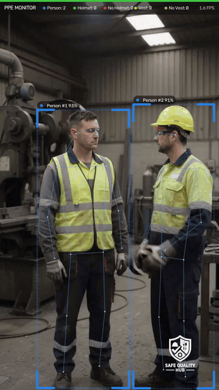
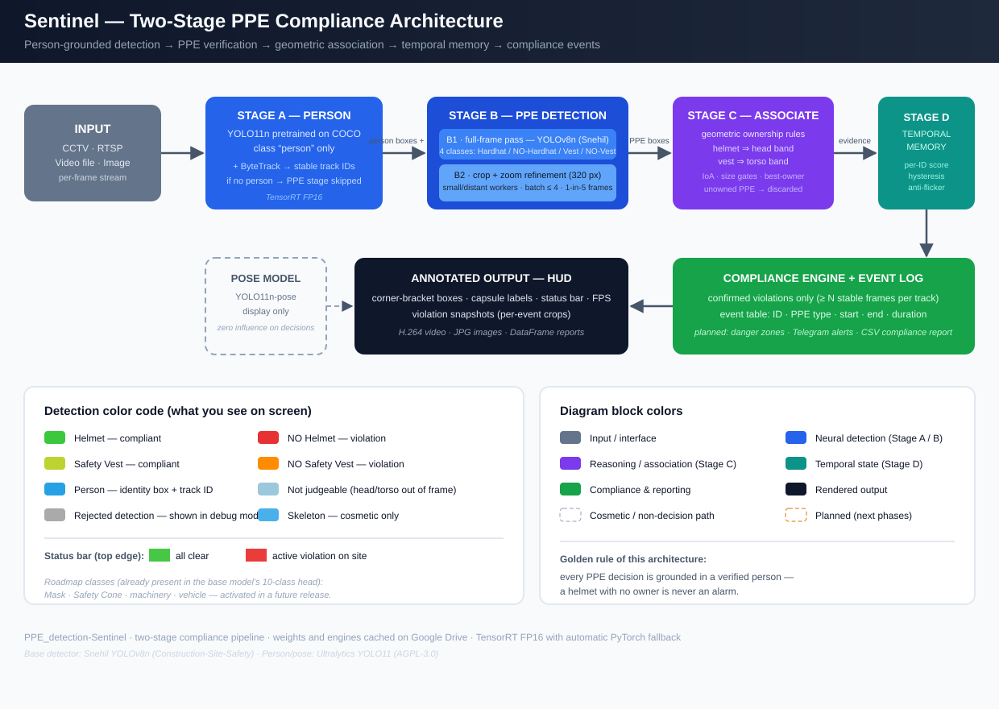
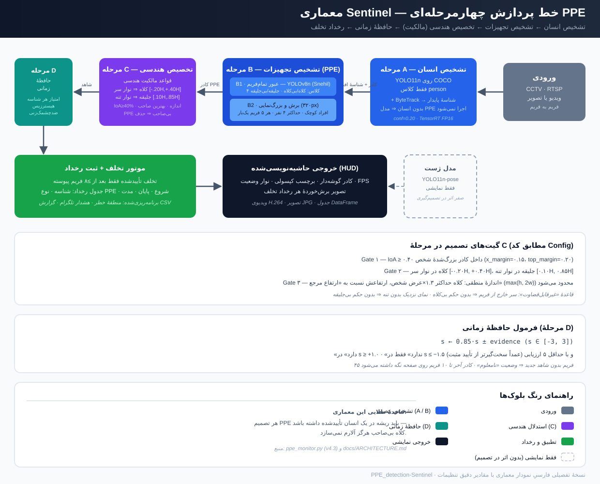
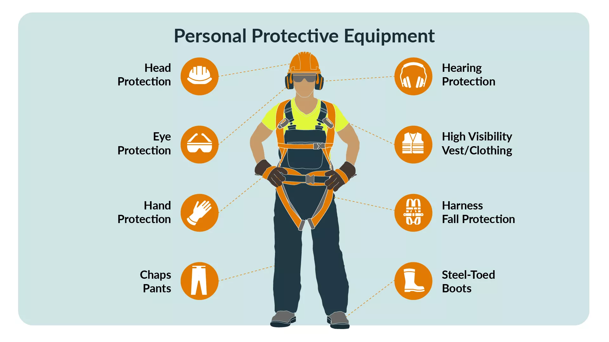
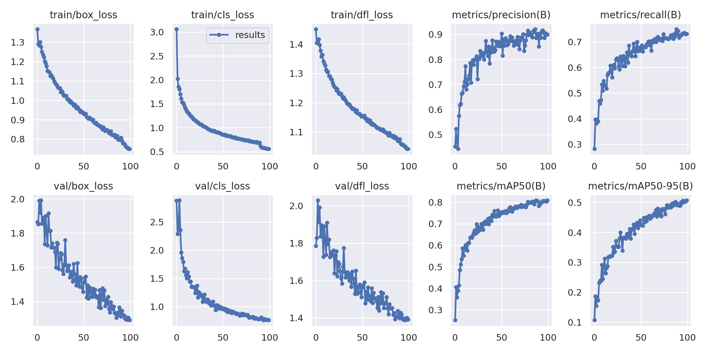
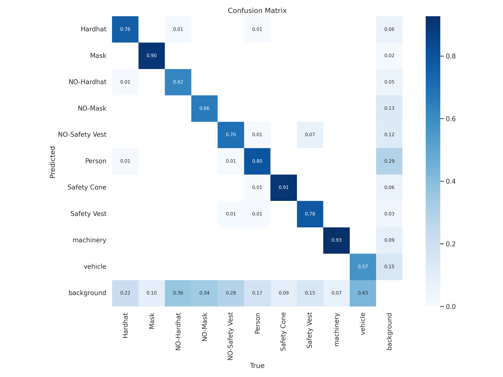
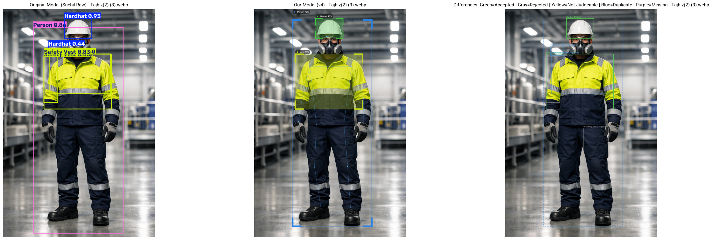
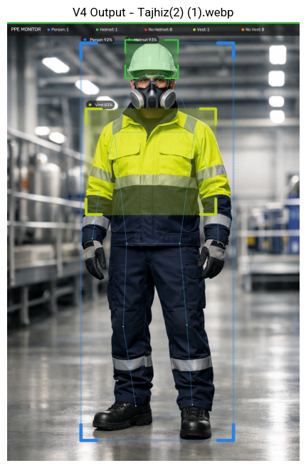
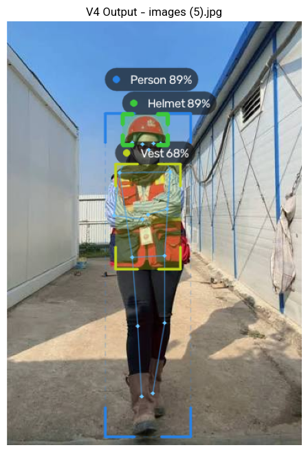
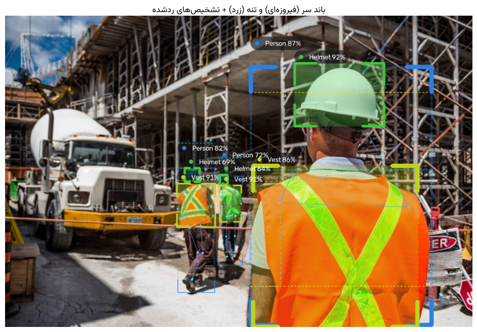

<div align="center">

# ⛑️ PPE_detection-Sentinel

**Real-time hard-hat & safety-vest compliance monitoring for construction-site CCTV — a person-grounded, two-stage detection pipeline with temporal decision smoothing.**

[](https://colab.research.google.com/github/ParsaVictor/PPE_detection-Sentinel/blob/main/notebooks/PPE_Monitor_Run.ipynb)


*Every PPE decision is grounded in a verified person — a helmet with no owner is never an alarm.*

</div>

---

## 📑 Contents

- [Demo](#-demo)
- [Why this exists](#-why-this-exists)
- [Architecture](#-architecture)
- [The base model (and the credit it deserves)](#-the-base-model-and-the-credit-it-deserves)
- [Side-by-side with the base model](#-side-by-side-with-the-base-model)
- [Output gallery](#-output-gallery)
- [Quick start (Google Colab, T4 GPU)](#-quick-start-google-colab-t4-gpu)
- [Notebooks & docs](#-notebooks--docs)
- [Known limitations](#-known-limitations)
- [Roadmap](#-roadmap)
- [Credits & lineage](#-credits--lineage)
- [فارسی — توضیح کوتاه](#-فارسی--توضیح-کوتاه)

---

## 🎬 Demo



*Two workers, one without a helmet — one stable violation event with a per-person identity (`Person #1`), not hundreds of flickering boxes. Live HUD: blue = person, green/red = helmet, lemon/orange = vest.*

<details>
<summary><b>▶ Full video versions (with sound-free smooth playback)</b></summary>

&nbsp;

- [Short demo — MP4 (10 s, portrait)](assets/demo_hero.mp4)
- [Extended demo — MP4 (60 s, landscape)](assets/demo_full.mp4)

</details>

---

## 🎯 Why this exists

Vanilla PPE detectors (including the excellent base model this project builds on) are **single-stage**: they look for helmets and vests anywhere in the frame. On real CCTV that breaks:

- 🚪 doors, walls and equipment get labeled *Hardhat* / *Safety Vest* → **phantom alarms**
- 🔀 a helmet two meters from its owner changes nothing — there are no owners at all
- ⚡ per-frame decisions flicker: the same person is "compliant / violating / compliant" three frames in a row
- 🫥 small or distant workers lose their PPE boxes

**Sentinel** restructures the same detector into a person-grounded pipeline and adds temporal reasoning — the base model's weights are untouched:

| Base-model weakness | Sentinel's answer | Measured effect (test video) |
|---|---|---|
| PPE boxes on doors & walls | PPE is only accepted **on a verified person's body** (COCO person detection + ByteTrack) | phantom alarms **eliminated**; 27% of raw PPE detections discarded as unowned |
| No identity between frames | **ByteTrack** gives every worker a stable ID | per-person violation timelines, not scattered boxes |
| Flickering per-frame verdicts | **temporal memory + hysteresis** per ID (violations need sustained evidence) | 44 frames of wrong "NO-Vest" → **0**; one stable event 0.13 s → 9.97 s |
| Small / distant workers missed | **crop + zoom second pass** (batched, with per-person cooldown) | distant helmets recovered at negligible cost |
| Close-up faces flagged "NO Vest" | **"not judgeable" rules** — no verdict when head/torso is out of frame | false negatives on portraits removed |
| Speed | **TensorRT FP16** for every model, PyTorch fallback | **×2.2–2.8** faster, 96–99% detection agreement |

---

## 🏗️ Architecture



<details>
<summary><b>📐 Detailed diagram in Persian — with exact gate values and the temporal-memory formula</b></summary>

&nbsp;



</details>

| Stage | What happens |
|---|---|
| **A — Person** | YOLO11n pretrained on **COCO** (person class only) + **ByteTrack** → stable IDs. No person in frame? The PPE model never runs. |
| **B — PPE detection** | Snehil **YOLOv8n**, only 4 of its 10 classes: `Hardhat / NO-Hardhat / Safety Vest / NO-Safety Vest`. **B1** full-frame pass · **B2** crop+zoom refinement (≤4 people/frame, 1-in-5-frames cooldown). |
| **C — Association** | Geometric ownership: helmet center must sit in the **head band**, vest center in the **torso band**, sane sizes (IoA ≥ 40%). Every PPE box goes to its best owner; **unowned PPE is discarded**. Positive vs negative witnesses compete per slot. |
| **D — Temporal memory** | Per-ID accumulated score with decay and **hysteresis**: `yes` at +1.0, `no` only at −1.5 with ≥5 evaluations. 45 frames without evidence → unknown. Violations become **events** (start/end/duration + snapshot crop). |
| **Compliance** | Confirmed events only (≥8 stable frames). Zone gating, Telegram alerts and a per-zone compliance CSV are implemented but deliberately commented (Section 14 of the dev notebook). |
| **Pose (dashed)** | YOLO11n-pose draws skeletons — **display only**, zero influence on any decision. (Putting pose *inside* the decision loop was tried in V3 and made detection worse — see `docs/HISTORY.md`.) |

### What each color means

Detection colors on screen:

| Color | Meaning | | Color | Meaning |
|---|---|---|---|---|
| 🟩 `#3cc83c` | **Helmet** — compliant | | 🟥 `#e63232` | **NO Helmet** — violation |
| 🟨 `#bed232` | **Safety Vest** — compliant | | 🟧 `#ff8c00` | **NO Safety Vest** — violation |
| 🟦 `#28a0e6` | **Person** — identity box + track ID | | ⬜ gray | Not judgeable / rejected (debug) |
| 🟦 light | Skeleton — cosmetic only | | 🟥 bar | top strip: red = active violation |

Roadmap classes — already present in the base model's 10-class head, activated in a future release: `Mask · Safety Cone · machinery · vehicle`.

Diagram block colors: slate = input · blue = neural detection · purple = reasoning · teal = temporal state · green = compliance · dashed gray = cosmetic path · dashed amber = planned.

---

## 🧠 The base model (and the credit it deserves)

The PPE detector is the custom-trained **YOLOv8n** from [**snehilsanyal/Construction-Site-Safety-PPE-Detection**](https://github.com/snehilsanyal/Construction-Site-Safety-PPE-Detection) — trained on the Roboflow [Construction Site Safety Image Dataset](https://universe.roboflow.com/roboflow-universe-projects/construction-site-safety) (2,801 images; 2,605 / 114 / 82 train/valid/test; also on [Kaggle](https://www.kaggle.com/datasets/snehilsanyal/construction-site-safety-image-dataset-roboflow)). Its weights ship in [`weights/`](weights/) so this repo is fully self-contained.

There are **10 classes** to detect from the dataset:

`'Hardhat', 'Mask', 'NO-Hardhat', 'NO-Mask', 'NO-Safety Vest', 'Person', 'Safety Cone', 'Safety Vest', 'machinery', 'vehicle'`



> Sentinel activates only the 4 PPE-compliance classes and replaces the dataset's own `Person` class with a COCO-pretrained person detector trained on hundreds of thousands of images — far more robust to distance, occlusion and domain shift than any 2.8k-image dataset can be. The remaining classes are a ready-made roadmap.

<details>
<summary><b>📊 Base-model training results (100 epochs, 2.72 h)</b></summary>

Final-epoch metrics (mean over all 10 classes): **mAP50 = 0.809 · mAP50-95 = 0.507 · precision = 0.900 · recall = 0.731**




</details>

---

## 🔬 Side-by-side with the base model

The dev notebook ships a three-panel comparison (raw Snehil / Sentinel / annotated differences with per-detection reasons) plus a match table — every difference between the two outputs is explained:



**How to read the difference panel:** 🟢 accepted · ⚪ rejected (label = reason) · 🟡 not judgeable · 🔵 duplicate/conflict · 🟣 missing (backend/NMS difference).

### Real numbers behind the redesign

Same two test videos, Google Colab Tesla T4, Ultralytics 8.4:

| | v1 (Snehil alone) | **Sentinel v2.1** | V3 (pose in decisions) | V4 (this repo) |
|---|---|---|---|---|
| Sample video (640×360, 1,826 f) — end-to-end FPS | 56.4 | 32.1 | 59.0 | 37.0 |
| `3.mp4` (720×1280, 300 f) — end-to-end FPS | 28.2 | 23.1 | 28.8 | ≈ V2 + TensorRT |
| Accepted helmet/vest detections on `3.mp4` (max 1,200) | — | **1,190** | 963 ❌ | = V2 |
| Phantom alarms on doors/walls | yes | **none** | none | none |
| Wrong "NO-Vest" frames (both workers wear vests) | 44 | **0** | 0 | 0 |

The V3 lesson is documented honestly in [`docs/HISTORY.md`](docs/HISTORY.md): pose-guided head regions collapse in profile views, so real helmets got rejected (`not_on_head`: 0 → 244). V4 keeps V2's decision logic exactly and uses pose purely for drawing — with TensorRT's accuracy benchmarked instead of assumed.

---

## 📸 Output gallery

| Live HUD on site footage | Per-person verdicts |
|---|---|
|  |  |



Every violation event also saves a cropped snapshot to `outputs/events/` — ready-made seeds for a fine-tuning dataset on your own site.

---

## 🚀 Quick start (Google Colab, T4 GPU)

Open [`notebooks/PPE_Monitor_Run.ipynb`](notebooks/PPE_Monitor_Run.ipynb) — three cells:

```python
import ppe_monitor as pm
pm.init()                 # first run ~10 min (weights + TensorRT engines, cached on Drive); then ~1 min
pm.analyze("3.mp4")       # any video or image → annotated output + events table + stats
```

Weights load straight from this repository — no external downloads, no Ultralytics asset fetch, nothing to configure. Everything (outputs, engines, event snapshots) is cached under `MyDrive/ppe_monitor/`.

Local use works the same way: clone the repo, `pip install -r requirements.txt`, `import ppe_monitor as pm; pm.init(base_dir="~/ppe_data")`.

### API

| Call | What it does |
|---|---|
| `pm.init(base_dir=..., **cfg)` | load models; override any `Config` parameter, e.g. `pm.init(backend="pytorch")` |
| `pm.analyze(path, debug=False, benchmark=False)` | video or image → annotated output, per-stage timing, violation events |
| `pm.compare(image)` | three-panel base-model comparison + match table with reasons |
| `pm.analyze_raw(path)` | raw Snehil output, all 10 classes, zero processing |
| `pm.benchmark_backends(video)` | TensorRT vs PyTorch: speed **and** detection agreement on the same frames |
| `pm.cfg` | every threshold, band and knob — see the tuning table in the dev notebook |

### Common tweaks

| Symptom | Fix |
|---|---|
| Distant people not captured | `pm.init(person_conf=0.15, person_model="yolo11s.pt")` |
| Real helmet rejected (`not_on_head`) | `pm.cfg.helmet_band = (-0.20, 0.45)` |
| Violations appear too late | `pm.cfg.on_violation = 1.2; pm.cfg.min_track_hits = 3` |
| Only helmets are mandatory | `pm.cfg.required_ppe = ("helmet",)` |
| TensorRT misbehaves | `pm.init(backend="pytorch")` — bit-for-bit V2 behavior |

---

## 📓 Notebooks & docs

| File | Purpose |
|---|---|
| [`notebooks/PPE_Monitor_Run.ipynb`](notebooks/PPE_Monitor_Run.ipynb) | **Start here** — 3 cells, full pipeline |
| [`notebooks/PPE_Monitor_Dev_V4.ipynb`](notebooks/PPE_Monitor_Dev_V4.ipynb) | 15-section walkthrough: every stage explained, geometry tuner, benchmark, zone/alert infrastructure |
| [`notebooks/fa/`](notebooks/fa/) | همین دو نوت‌بوک به فارسی (the same two notebooks in Persian) |
| [`docs/ARCHITECTURE.md`](docs/ARCHITECTURE.md) | Stage-by-stage design + rejection-reason reference |
| [`docs/HISTORY.md`](docs/HISTORY.md) | V1 → V4.3 version log with real numbers and failed experiments |

---

## ⚠️ Known limitations

- A helmet held in a hand or resting near — but not on — a head can still pass the geometric gates and be accepted.
- Errors baked into the base Snehil model (e.g. a yellow shirt read as a safety vest) are not corrected by the association or temporal stages; Sentinel only decides *whether an already-detected box belongs to a person*, not whether the detector's own classification is right.
- The PPE detector was trained on 2,801 images from one dataset; accuracy on a new site's lighting, camera angle or PPE colors is not guaranteed without fine-tuning.
- The root fix for both of the above is fine-tuning the PPE model on real site footage — the crops in `outputs/events/` are the intended seed dataset. Full write-up: [`docs/HISTORY.md`](docs/HISTORY.md#lessons).

---

## 🗺️ Roadmap

- [ ] Activate **zones + Telegram alerts + compliance CSV** (code ready & commented — Section 14)
- [ ] Enable the dormant classes: `Mask`, `Safety Cone`, `machinery`, `vehicle`
- [ ] Fine-tune the PPE model on real site footage (event snapshots are the seed dataset)
- [ ] Multi-camera batched inference (one shared GPU), ONNX/OpenVINO for CPU deployments
- [ ] Streamlit live dashboard (RTSP)

---

## 🙏 Credits & lineage

- **[snehilsanyal/Construction-Site-Safety-PPE-Detection](https://github.com/snehilsanyal/Construction-Site-Safety-PPE-Detection)** — the custom YOLOv8n PPE detector, dataset curation and training. This project is a ground-up restructure *around* that model (kept as [`fork`](https://github.com/ParsaVictor/Construction-Site-Safety-PPE-Detection) with thanks 🙌), not a replacement for it. General improvements will be contributed back.
- **[Ultralytics](https://github.com/ultralytics/ultralytics)** — YOLO11n (person), YOLO11n-pose, ByteTrack integration, TensorRT export (AGPL-3.0).

**License:** AGPL-3.0 — inherited from the Ultralytics ecosystem. Commercial licensing paths are the same as Ultralytics'.

---

<div dir="rtl" align="right">

---

## 🇮🇷 فارسی — توضیح کوتاه

**PPE_detection-Sentinel** سامانه‌ی پایش خودکار کلاه ایمنی و جلیقه‌ی شبرنگ روی تصاویر دوربین مداربسته‌ی کارگاه ساختمانی است.

مدل پایه (Snehil YOLOv8n) عالی است اما چون همه‌چیز را «بدون صاحب» تشخیص می‌دهد، روی در و دیوار هم کلاه و جلیقه می‌بیند و وضعیت هر فریم چشمک می‌زند. این پروژه دور همان مدل، یک معماری دومرحله‌ای ساخت:

1. **انسان** با مدل COCO + ByteTrack پیدا و شماره‌گذاری می‌شود؛
2. **کلاه و جلیقه فقط روی سر و تنه‌ی همان انسان** پذیرفته می‌شود؛
3. **حافظه‌ی زمانی** برای هر نفر نگه داشته می‌شود تا تخلف فقط بعد از چند فریمِ پیوسته اعلام شود؛
4. سرعت با TensorRT حدود ۲.۵ برابر شده و اسکلت بدن فقط برای نمایش رسم می‌شود.

نتیجه روی ویدئوی آزمایشی: آلارم الکی **صفر**، ۱۱۹۰ تشخیص پذیرفته از ۱۲۰۰، و به‌جای صدها باکس پراکنده، **یک رخداد پایدار و درست**.

نمودار تفصیلی معماری به فارسی — با مقادیر دقیق گیت‌ها و فرمول حافظهٔ زمانی: [`assets/architecture_fa.svg`](assets/architecture_fa.svg)

اجرای سریع در Colab: نوت‌بوک `Run` را باز کن و سه سلولش را اجرا کن — همه‌ی وزن‌ها داخل همین ریپازیتوری است. نسخه‌ی فارسی نوت‌بوک‌ها در پوشه‌ی `notebooks/fa/` است.

</div>
